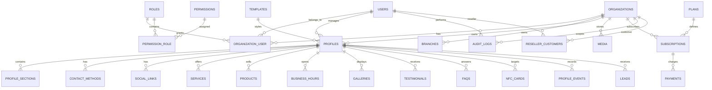

# BATAQAH Digital Business Profile Platform

## 1. Application architecture

BATAQAH is a Laravel 13 modular monolith. Modules share one deployment and database while keeping domain rules, authorization, events, jobs, and tests isolated enough to extract later.

### Modules

| Module | Responsibility |
|---|---|
| Identity | Registration, login, email verification, password reset, optional 2FA, account lifecycle |
| Organizations | Tenant membership, branches, invitations, roles, billing/contact details |
| Profiles | Profile builder, sections, contacts, social links, services, products, hours, templates |
| Media | Validated uploads, variants, local/S3 storage, signed access, quotas |
| Publishing | Approval workflow, slugs, public visibility, vCards, sharing and SEO |
| QR & NFC | Permanent QR assets, secure NFC tokens, assignment and redirect lifecycle |
| Engagement | Leads, public actions, privacy-conscious analytics and retention |
| Billing | Plans, subscriptions, entitlements, limits and payment-provider abstractions |
| Administration | Platform operations, resellers, moderation, templates, settings and exports |
| Platform | Audit log, notifications, queues, cache, scheduler, localization and observability |

### Boundaries and request flow

1. HTTP routes invoke Form Requests and thin controllers or Livewire actions.
2. Application actions/services execute use cases and enforce policies.
3. Domain models own invariants, state transitions and relationships.
4. Events decouple analytics, audit logging, notifications, QR generation and media processing.
5. Queued listeners handle slow or retryable work.

Tenant-owned models implement an organization scope and are authorized with policies. Organization IDs submitted by clients are never trusted; organization context is derived from the authenticated membership or authorized route model.

## 2. Database ER diagram



## 3. Complete table plan

### Identity and authorization

- `users`: UUID, name, email unique, password, locale, timezone, verification/2FA fields, status, last login, timestamps, soft delete.
- `organizations`: UUID, owner, name, legal/trading names, slug, billing/contact JSON, locale, status, timestamps, soft delete.
- `organization_user`: organization, user, role, membership status, invited/accepted timestamps; unique organization/user.
- `roles`, `permissions`, `permission_role`: platform and organization role definitions with unique slugs.
- `terms_acceptances`: user, organization, document/version, IP hash, accepted timestamp.
- `account_requests`: export/deletion workflow, status, requested/completed timestamps.

### Profile content

- `branches`: organization, name, contact/address/location fields, status.
- `profiles`: UUID, organization, owner, branch, template, type, unique slug, identity/content fields, language, style configuration JSON, workflow/status timestamps, expiry, soft delete.
- `profile_sections`: profile, type, title, enabled, position, configuration JSON; unique profile/type.
- `contact_methods`: profile, type, label, value, URL, visibility, position.
- `social_links`: profile, network, label, URL, position, visibility.
- `services`, `products`: profile, title, slug, description, price/currency/contact-for-price, status, position, soft delete.
- `business_hours`: profile, weekday, opens/closes, closed/24-hour flags, unique profile/weekday.
- `galleries`: profile, title, type, position.
- `testimonials`: profile, author/company/content/rating, status, position.
- `faqs`: profile, question, answer, position, enabled.

### Media and templates

- `media`: UUID, organization, uploader, attachable morph, disk/path, original/stored names, MIME, extension, size, checksum, width/height, visibility, processing status, metadata JSON, soft delete.
- `templates`: name, slug unique, preview, component, default configuration JSON, supported sections JSON, active/premium flags, timestamps.

### QR, NFC, leads and analytics

- `nfc_cards`: UUID, organization nullable, profile nullable, secure token unique, serial/reference, status, assigned/activated/expired timestamps, metadata JSON, soft delete.
- `profile_events`: profile, organization, event type, occurred date/time, anonymous visitor hash, session hash, referrer host, UTM fields, metadata JSON; indexes on profile/type/date and organization/date.
- `leads`: UUID, profile, organization, name, email, phone, message, consent, status, source, submitted timestamp, soft delete.

### Plans and operations

- `plans`: name, slug unique, price/currency/interval, limits JSON, features JSON, active/public flags.
- `subscriptions`: organization, plan, provider fields, status, trial/period/grace/ended timestamps; indexed organization/status.
- `payments`: organization, subscription, provider/reference unique, amount/currency/status, paid timestamp, payload JSON.
- `reseller_customers`: reseller user, customer organization, assigned timestamp; unique reseller/organization.
- `audit_logs`: organization nullable, actor nullable, action, subject morph, before/after JSON, request ID, IP hash, user-agent summary, created timestamp.
- `settings`: scope type/id, key, encrypted/value JSON; unique scope/key.
- Laravel infrastructure: jobs, failed jobs, job batches, cache, cache locks, sessions, notifications, personal access tokens, password reset tokens.

All foreign keys use explicit cascade/restrict/null behavior. Public identifiers are UUIDs/slugs/tokens; sequential IDs never appear in public URLs.

## 4. Web route and API plan

### Web

- Guest/auth: `/register`, `/login`, email verification, password reset, terms acceptance.
- Onboarding: `/onboarding/{step}` for organization, profile basics, contacts, content, media, design, preview and publish.
- Customer: `/dashboard`, `/profiles`, `/profiles/{profile}/builder/{step}`, analytics, leads, subscription, team and settings.
- Staff/admin: `/admin` with customers, organizations, profiles, approvals, users, resellers, NFC, templates, plans, subscriptions, payments, leads, audit logs and settings.
- Reseller: `/reseller` with assigned organizations, profiles, NFC and statistics.
- Public: `GET /p/{profile:slug}`, vCard, QR downloads, share/engagement redirects and lead submission.
- NFC: `GET /n/{token}` resolving only active cards and active published profiles.

### API v1

- `POST /api/v1/auth/register|login|forgot-password|reset-password`, `POST /logout`, `GET /user`.
- CRUD `/organizations`, memberships and branches.
- CRUD `/profiles`, builder resources, preview, submit, publish and unpublish actions.
- Nested services, products, contacts, social links, hours, sections and galleries.
- Media upload/finalize/delete endpoints with policy and quota enforcement.
- Read templates; authorized NFC lifecycle endpoints.
- Analytics summaries/timeseries/events and lead management.
- Account settings, export and deletion requests.
- Signed, rate-limited `/api/v1/webhooks/{provider}` endpoints with replay protection.

Responses use API Resources, consistent envelopes, cursor/page pagination, validation errors, idempotency for sensitive writes, Sanctum authentication and policy checks.

## 5. Module and folder structure

```text
app/
  Domain/{Identity,Organizations,Profiles,Media,Publishing,QrNfc,Engagement,Billing,Admin}/
    Actions/ Data/ Enums/ Events/ Jobs/ Listeners/ Services/
  Http/{Controllers,Middleware,Requests,Resources}/
  Livewire/{Auth,Onboarding,Customer,Admin,Reseller,ProfileBuilder}/
  Models/ Policies/ Providers/ Support/
database/{factories,migrations,seeders}/
resources/{css,js,views/{components,layouts,livewire,public,emails},lang/{en,ar}}/
routes/{web.php,api.php,console.php,channels.php}/
tests/{Feature,Unit,Architecture}/
docs/{ARCHITECTURE.md,API.md,DEPLOYMENT.md,BACKUP-RECOVERY.md}
```

## 6. Development milestones

1. **Foundation**: Laravel 13, Livewire, Tailwind, quality tools, CI, environment and base design system.
2. **Identity and tenancy**: authentication, verification, roles, policies, organizations, memberships, terms, isolation tests.
3. **Profile builder**: wizard, autosave, media, contacts, content, templates, RTL and live mobile preview.
4. **Publishing**: approval workflow, public profile, SEO, sharing, vCard and visibility rules.
5. **QR and NFC**: permanent assets, secure tokens, assignment lifecycle, downloads and redirect analytics.
6. **Engagement**: leads, action tracking, anonymization, retention jobs and customer analytics.
7. **Commercial/admin**: plans, entitlements, subscriptions, reseller scope, admin CRUD, exports and audit logs.
8. **API and integrations**: Sanctum API v1, resources, webhooks and API documentation.
9. **Hardening**: authorization matrix, upload security, headers, rate limits, backups, accessibility and performance.
10. **Release**: Qatar demo data, acceptance suite, staging soak, production runbook and controlled cutover from CalcApp.

The current calculator remains on `main` during development. Cutover occurs only after the acceptance suite passes and the production environment has MySQL, Redis, storage, queue workers, scheduler, SSL and backups configured.
